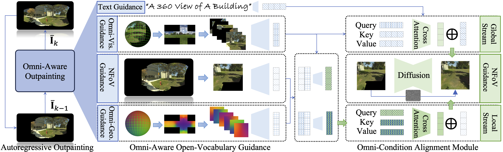
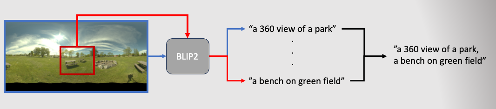

# [AAAI'24] Autoregressive Omni-Aware Outpainting for Open-Vocabulary 360-Degree Image Generation


# Abstract 
A 360-degree (omni-directional) image provides an all-encompassing spherical view of a scene. Recently, there has been an increasing interest in synthesising 360-degree images from conventional narrow field of view (NFoV) images captured by digital cameras and smartphones, for providing immersive experiences in various scenarios such as virtual reality. Yet, existing methods typically fall short in synthesizing intricate visual details or ensure the generated images align consistently with user-provided prompts. In this study, autoregressive omni-aware generative network (AOG-Net) is proposed for 360-degree image generation by outpainting an incomplete 360-degree image progressively with NFoV and text guidances joinly or individually. This autoregressive scheme not only allows for deriving finer-grained and text-consistent patterns by dynamically generating and adjusting the process but also offers users greater flexibility to edit their conditions throughout the generation process. A global-local conditioning mechanism is devised to comprehensively formulate the outpainting guidance in each autoregressive step. Text guidances, omni-visual cues, NFoV inputs and omni-geometry are encoded and further formulated with cross-attention based transformers into a global stream and a local stream into a conditioned generative backbone model. As AOG-Net is compatible to leverage large-scale models for the conditional encoder and the generative prior, it enables the generation to use extensive open-vocabulary text guidances. Comprehensive experiments on two commonly used 360-degree image datasets for both indoor and outdoor settings demonstrate the state-of-the-art performance of our proposed method. 



# Installation 
The code requires python>=3.8, as well as pytorch>=2.0, torchvision>=0.8, diffusers>=0.21.0 and accelerate>=0.19.0. The cuda version used in this work is cuda 12.1.
## Glone this repository
```
git clone https://github.com/zhuqiangLu/AOG-NET-360.git
cd AOG-NET-360
```
## Create virtual env
```
conda create -n aog python=3.10 -f requirement.txt
conda activate aog
```

# Dataset
[Laval Indoor HDR](http://hdrdb.com/indoor/) [1] and [Laval Outdoor HDR](http://hdrdb.com/outdoor/) [2] are used in this work. 


# Preprocessing - exr
The images in these two datasets are in ```.exr``` format, to convert ```.exr``` images to ```.png```, you can run
```
python misc/exr2png.py --image_dir [path_to_exr_imgaes] --out_dir [path_to_png_images] --num_workers 60
```
The this script leverage multiprocessing to convert images, by default, the number of job is 60, but you can set a higher or lower number according to your hardware.

# Preprocessing - captioning 
Both datasts do not come with text prompts, we also provide a script to extract text prompt for each 360-degree image using BLIP2[3]. Run
```
python misc/captioning --image_dir [path_to_png_imgaes] --out_dir [path_to_text_prompt] --name [dataset_name]
```
As mentioned in paper, the BLIP2[3] model may fail to provide detailed prompt due to the 360-degree image is being resized, to extract augmented text prompt, you can run 

```
python misc/captioning --image_dir [path_to_png_imgaes] --out_dir [path_to_text_prompt] --name [dataset_name] --stride 30 --augment 
```
The ```--stride``` define the distance between two patches selected, you can set a number in range of ```[0, 360]```
The augmented captioning is illustrated as follow


# Training
To train this model, run 
```
python main.py -b config/train_config.yaml --n [exp_name] 
```
if you have ```wandb``` account, simply add ```-w --wandb_id [the project name on wandb]```

# Inference
To inference, run 
```
python inference.py -b config/inference_config.yaml --checkpoint [path to ckpt] --inference_out_dir [path_to_infernce_result] --num_inference_step 50 --cfg_scale 2.5
```
You may define the inference image as a dataset in ```config/inference_config.yaml```.

# Troubleshooting
1. ```Expected is_sm80 to be true, but got false```. Since I have left this project for a while, there may be some versioning issues. I run it on a RTX 3090 recently, I got this ```is_sm80``` error. This error is resolved by updating ```pytorch``` to the latest version.
2. Make sure you use the modified version of ```PyEquilib```, the official one will lead to some coloring issue.
   

# Citing 
```
@article{lu2023autoregressive,
  title={Autoregressive Omni-Aware Outpainting for Open-Vocabulary 360-Degree Image Generation},
  author=Zhuqiang Lu and Kun Hu and Chaoyue Wang and Lei Bai and Zhiyong Wang}
  booktitle={AAAI},
  year={2024}
}

```
# Acknowledgement
this project is build upon [Diffusers](https://github.com/huggingface/diffusers) and [PyEquilib](https://github.com/haruishi43/equilib)

# Reference
[1] Gardner, M. A., Sunkavalli, K., Yumer, E., Shen, X., Gambaretto, E., Gagné, C., & Lalonde, J. F. (2017). Learning to predict indoor illumination from a single image. arXiv preprint arXiv:1704.00090.

[2] Yannick Hold-Geoffroy, Akshaya Athawale, and Jean-François Lalonde Deep Sky Modeling for Single Image Outdoor Lighting Estimation IEEE Conference on Computer Vision and Pattern Recognition (CVPR), 2019.

[3] Li, J., Li, D., Savarese, S., & Hoi, S. (2023). Blip-2: Bootstrapping language-image pre-training with frozen image encoders and large language models. arXiv preprint arXiv:2301.12597.
